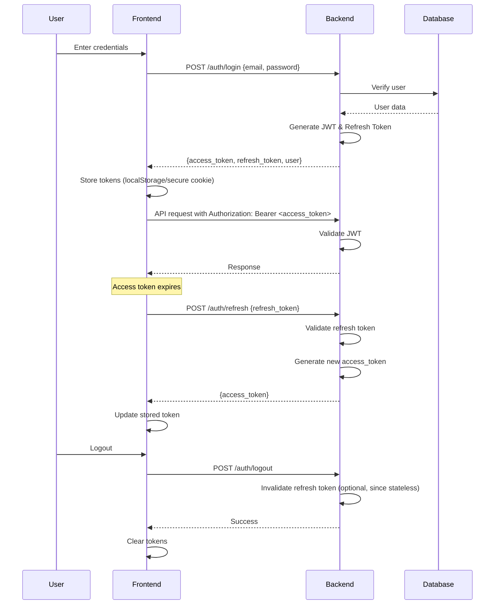

# Authentication Flow for CodeHub

## Overview
JWT-based authentication with refresh tokens for security and session management. Stateless on server-side, tokens stored client-side.

## Flow Diagram (Mermaid)

## Token Details
- **Access Token**: Short-lived (15-30 min), contains user ID, role
- **Refresh Token**: Long-lived (7-30 days), used to get new access tokens
- **Storage**: Secure HTTP-only cookies for production, localStorage for dev
- **Signing**: RSA or HMAC, stored securely

## Security Measures
- Password hashing with bcrypt
- Rate limiting on auth endpoints
- Token blacklisting for logout (optional, use short expiry)
- HTTPS required
- CSRF protection if using cookies

## Role-Based Access
- User roles: user, admin
- Guards check JWT payload for role
- Admin endpoints protected

## Error Handling
- Invalid tokens: 401 Unauthorized
- Expired tokens: 401, client refreshes
- Invalid credentials: 400 Bad Request

## Implementation Notes
- Use passport-jwt in NestJS
- Middleware for token validation
- Refresh endpoint checks refresh token validity

This flow ensures secure, scalable authentication suitable for high-traffic apps.